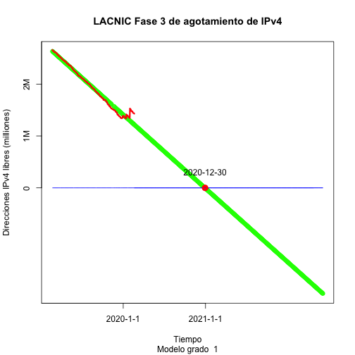
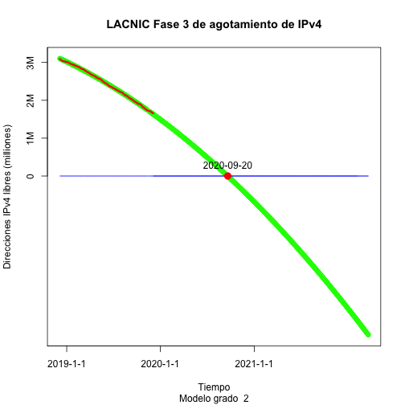
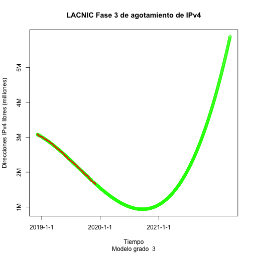

LACNIC IPv4 Phase 3 Report
========================================================
author: Carlos Martinez
date: December 5, 2019
autosize: true

Relevant Policies and Data Sources Used 
========================================================

Phase 3 of IPv4 Runout began on February 15, 2017. Please see <http://www.lacnic.net/agotamiento>.

- The "Available IPv4 in LACNIC" dataset can be found at <http://opendata.labs.lacnic.net/ipv4stats/ipv4avail/lacnic?lastdays=320>.
- Reserved and availbe IPv4 space: 

```
[1] 1543680
```


Predicted Phase 3 End Date (Deg. 1)
========================================================



Predicted Phase 3 End Date (Deg. 2)
========================================================



Predicted Phase 3 End Date (Deg. 3)
========================================================



Predicted Cutoff Dates
========================================================

- Degree 1:

```
[1] "2021-01-28"
```

- Degree 2:

```
[1] "2020-09-20"
```

- Degree 3:

```
[1] NA
```


